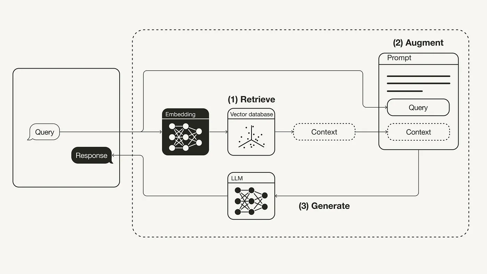

## Table of Contents
- [Description](#description)
- [Design System](#design-system)
- [Installation Backend](#installation-backend)
- [Installation Frontend](#installation-frontend)
- [Contributing](#contributing)
- [Contact](#contact)

# Description
This project implements a Chatbot using Retrieval-Augmented Generation (RAG) with Django, Websockets, and React.js. The backend, built with Django, handles data retrieval and processing, while real-time communication is facilitated through Websockets. The frontend, developed in React.js, provides an interactive user interface for seamless chatbot interactions.

# Design System

